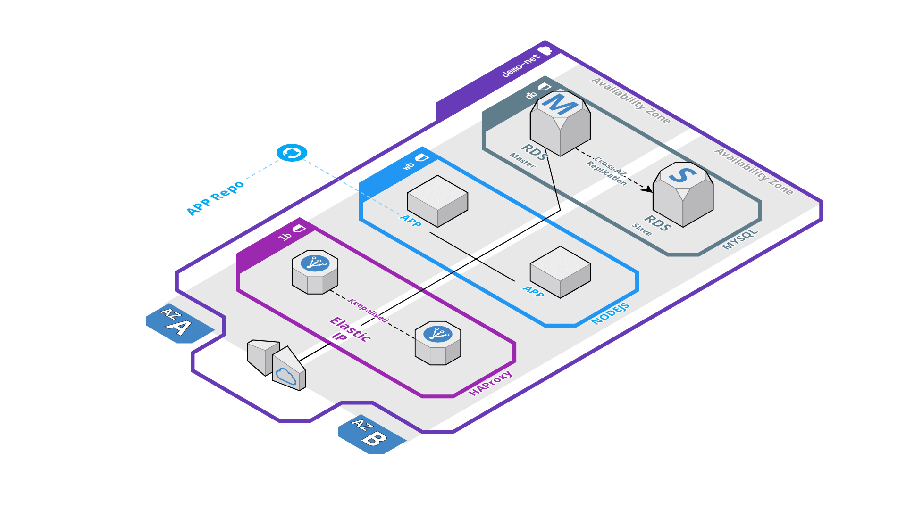

# nodejs_demo_app


[](LICENSE)

Visit [live demo site](https://demo-app.yamipa.com)



# Overview
* Fault tolerance:
    * Roles: At least two roles in each layer: master and backup
    * Points of failure: Avoid single points of failure
* High availability:
    * Load balancing: load distribution among available resources
    * Multi zones: resources placed in different availability zones
* Scalability
    * Layers: resources are placed in three main layers: wb, lb, db

## Requeriments
1. Ansible >= 1.5
2. AWS credentials configure in Ansible Host

## Quickstart
``` bash
ansible-playbook -i environments/test/inventory/ main.yml
```

### Ansible

Simple structure:

    ├── environments/
    └── roles/


* **environments** This folder is for working with different environments. It contains contextual data for each one. For example: inventory, files, documentation, templates.

* **roles** This folder contains ansible roles: aws, lb, wb


#### Playbooks

* ```main.yml``` is the main playbook. It configures everything, from AWS resources like IAM, EC2, VPC, RDS to packages and customization in each layer.

* ```letsencrypt.yml``` creates or renew certificates.

### Remote connection
For connection via ssh, set variable ```instance_ip``` and:

```bash
ssh -i environments/test/.artifacts/.ssh/id_rsa admin@${instance_ip}
```

### Letsencrypt
> It can handle creation, renewal, certificate placement and haproxy reload in both balancers

Just set ```le_domain``` and run letsencrypt playbook. For example:
``` bash
ansible-playbook -i environments/test/inventory/ letsencrypt.yml -e le_domain="demo-app.yamipa.com"
```
